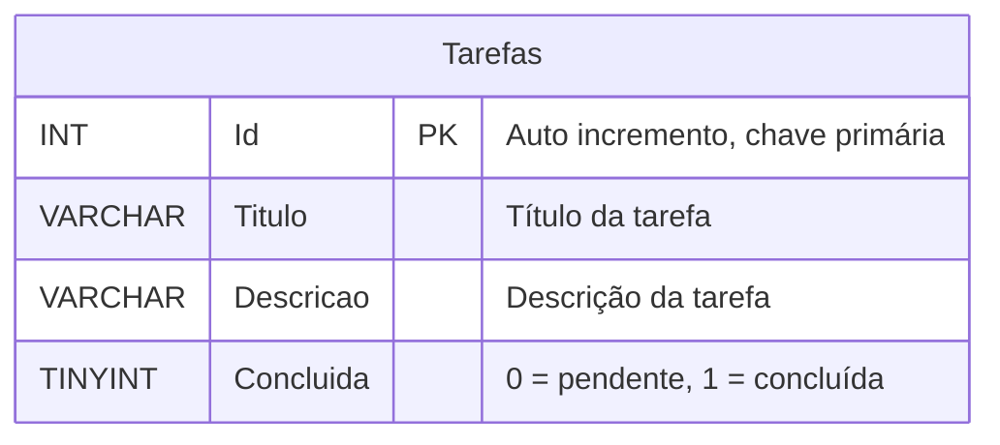

---

**Descrição dos campos:**
- `Id`: Identificador único da tarefa (auto incremento, chave primária)
- `Titulo`: Título da tarefa
- `Descricao`: Descrição da tarefa
- `Concluida`: Status (0 = pendente, 1 = concluída)
